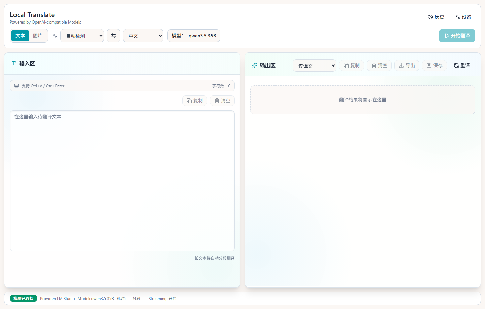

# Local Translate (Tauri + React)

本仓库已按 `P0 + P1` 目标搭建 0→1 基础实现，覆盖：

- 文本 / 图片翻译主流程
- 设置管理（Provider + App Settings）
- 历史记录（保存 / 搜索 / 收藏 / 删除 / 重载）
- 导出（txt / md / docx）
- 前后端分层（UI / service / adapter / Tauri command / db）

## 技术栈

- Desktop: Tauri 2
- Frontend: React + TypeScript + Vite
- UI: Tailwind + shadcn 风格组件
- State: Zustand + TanStack Query
- Form: React Hook Form + Zod
- Storage: SQLite (Rust/rusqlite)
- Model: LM Studio (OpenAI-compatible API)

## Web 页面截图



> 截图生成时间：2026-03-29，来源：本地 `vite preview` 渲染页面。

## 目录结构

```text
src/
  app/
  pages/
  components/
  stores/
  services/
  adapters/
  lib/
  schemas/
  types/

src-tauri/
  src/
    commands/
    services/
    db.rs
    models.rs
    lib.rs
```

## 本地开发

1. 安装 Node.js 24+
2. 安装 Rust 工具链（Tauri 必需）
3. 安装依赖：

```bash
npm install
```

4. 前端开发模式：

```bash
npm run dev
```

web 端如果遇到 LM Studio 的 `OPTIONS` 预检失败，可在根目录创建 `.env.local`：

```bash
VITE_LM_STUDIO_PROXY_TARGET=http://192.168.20.10:1234
```

开发环境会通过 `/lmstudio/*` 代理到该地址，避免浏览器跨域预检问题。

5. Tauri 桌面开发模式：

```bash
npm run tauri:dev
```

## 构建与测试

```bash
npm run lint
npm run test:run
npm run build
```

可选 E2E（需安装 Playwright 浏览器）：

```bash
npx playwright install
npm run test:e2e
```

## 部署指南

### 1. Web 静态部署（用于浏览器版）

1. 安装依赖并构建：

```bash
npm install
npm run build
```

2. 部署 `dist/` 目录到静态托管平台（Nginx / Vercel / Netlify / GitHub Pages 均可）。

3. 如果要在 web 端直连 LM Studio，请确保部署环境可以访问 LM Studio 地址，并处理好跨域：
- 开发环境可用 Vite 代理（`/lmstudio`）。
- 生产环境建议在反向代理层配置同源转发（例如 `/lmstudio -> http://<lmstudio-host>:1234`）。

4. 本地快速验证部署产物：

```bash
npm run preview -- --host 0.0.0.0 --port 4173
```

### 2. Windows 桌面部署（Tauri MSI）

1. 安装 Rust（必须）：

```bash
winget install Rustlang.Rustup
```

2. 安装依赖并构建前端：

```bash
npm install
npm run build
```

3. 构建桌面安装包：

```bash
npm run tauri:build
```

4. 构建产物默认在：
- `src-tauri/target/release/bundle/msi/`

5. 分发方式：
- 内网分发：直接发 MSI 安装包。
- 版本升级：建议按版本号管理 MSI 并配套更新日志。

## 命令域（Tauri）

- `provider_*`: 连接测试、模型列表、预热
- `translate_*`: 文本/图片/文档翻译
- `history_*`: 历史记录 CRUD + 收藏
- `settings_*`: 配置读写
- `files_*`: 文档解析
- `export_*`: 结果导出

## 里程碑回看清单（防失忆）

- 阶段 1（骨架）：回看 [Development.md](./PRDs/Development.md) 第 3/4/6/17/20 节、[ui.md](./PRDs/ui.md) 第 3/4/11/14 节。
- 阶段 2（设置+Provider）：回看 [Development.md](./PRDs/Development.md) 第 5.3/5.6/11.1/12 节、[prd.md](./PRDs/prd.md) 第 2.3 节、[ui.md](./PRDs/ui.md) 第 7.2.1 节。
- 阶段 3（文本主链路）：回看 [Development.md](./PRDs/Development.md) 第 9.1/10/14 节、[prd.md](./PRDs/prd.md) 第 2.1.1/2.2.1/2.4 节、[ui.md](./PRDs/ui.md) 第 5.1/5.2.1/5.3 节。
- 阶段 4（历史与体验）：回看 [Development.md](./PRDs/Development.md) 第 5.5/11/18 节、[prd.md](./PRDs/prd.md) 第 2.2.3/3.3 节、[ui.md](./PRDs/ui.md) 第 6/12.1 节。
- 阶段 5（图片/文档）：回看 [Development.md](./PRDs/Development.md) 第 3.6/3.7/9.2/9.3 节、[prd.md](./PRDs/prd.md) 第 2.1.2/2.1.3/3.6/3.7 节、[ui.md](./PRDs/ui.md) 第 5.2.2/5.2.3/8.2/8.3 节。
- 阶段 6（冲刺发布）：回看 [Development.md](./PRDs/Development.md) 第 14/15/16/18 节、[prd.md](./PRDs/prd.md) 第 12 节、[ui.md](./PRDs/ui.md) 第 9/10/13 节。

## 当前注意事项

- 当前环境若未安装 Rust，`tauri:dev/tauri:build` 无法执行。
- 文档翻译模式已在前端临时下线（避免乱码问题），当前保留文本与图片翻译。
- `DOCX/PDF` 解析依赖 Rust 侧第三方库，建议在安装 Rust 后优先跑一次端到端验证。
- `eslint` 仍有 1 条 React Compiler 兼容性 warning（`react-hook-form watch`），不阻塞构建与测试。
